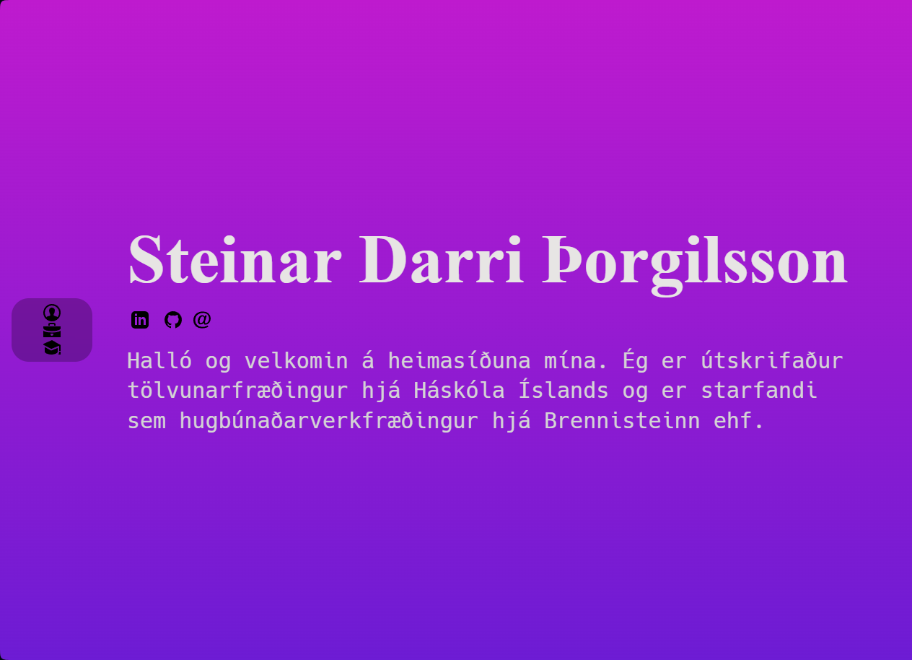

# My personal blog written using [Rust](https://www.rust-lang.org)!

This is my personal website I built using [Yew](https://yew.rs) and [TailwindCSS](https://tailwindcss.com/)

I used [Max Mohr's](https://github.com/maxjmohr/personal_website) amazing website project as a template

## How to run

### Rust, Yew & Trunk

We will need the standard [Rust toolchain](https://www.rust-lang.org/learn/get-started), including `rustup`, `rustc` and `cargo`

Yew uses [WebAssembly](https://webassembly.org) and needs Rust to have it's target

`rustup target add wasm32-unknown-unknown`

We also need the wasm-opt package to optimizes our WebAssembly modules

`cargo install wasm-opt`

To run the project first of all you need to have `trunk` installed on your machine

`cargo install trunk`

then

`trunk serve --open` which builds the website then looks out for edits and refreshes the page when they are found

or

`trunk serve`

and open your browser on [http://localhost:8008](http://localhost:8008)

To build for release

`trunk build --release`

### TailwindCSS

This project uses Tailwind to manage styles and Prettier to format the CSS

To install, we will need [Node.js](https://nodejs.org/en/download) to get the packages

After that, to install all dependencies listed in package.json

`npm install`

To have Tailwind generate our styles we run

`npm run css` listens for changes and rebuilds when found (might get a 'JavaScript heap out of memory' error during runtime)

`npm run build` builds a minimal css file

## Building & Deployment

To build for release and deployment, use

`build_release.sh`

as the bash build command, with `/dist` as the output directory and `/` as the root
